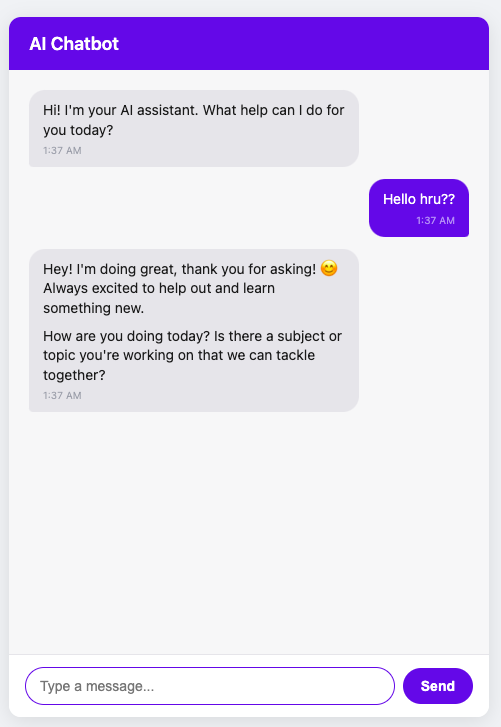

# AI Chatbot

A web-based AI chatbot with a chat interface, built with Flask and vanilla JavaScript, powered by Google's Gemini API. Conversation history persists across server restarts via SQLite, and the app is deployed live on the internet.

**🔗 Live demo:** [zohahussayn.pythonanywhere.com](https://zohahussayn.pythonanywhere.com)



## Status: Complete — core features + deployment

**What it does:**
- A styled chat window UI (message bubbles, input box, send button) built with HTML/CSS flexbox
- Real-time messaging via `fetch()` between the frontend and a Flask backend
- **Real AI responses** via the Gemini API (`gemini-3.6-flash`)
- **Conversation memory** — the bot remembers earlier messages within a session
- **Persistent storage (SQLite)** — chat history survives server restarts, tied to each browser session
- **A defined persona** — the bot is "StudyBuddy," a friendly study companion that also helps with code
- **UI polish** — animated typing indicator, message timestamps, lightweight Markdown rendering (bold, headings, bullet lists) in bot replies
- **Input validation & rate limiting** — empty-message blocking, a message length cap, and the Send button disables while waiting for a reply (prevents duplicate/overlapping requests)
- **Deployed live** on PythonAnywhere, tested end-to-end in production

## Tech stack

- **Backend:** Python, Flask
- **Frontend:** HTML, CSS (flexbox), vanilla JavaScript (`fetch` API)
- **AI:** Google Gemini API, called directly via `requests` (REST API, no SDK)
- **Database:** SQLite, via Python's built-in `sqlite3` module
- **Environment management:** `python-dotenv`
- **Deployment:** PythonAnywhere (WSGI)

## Architecture

The browser never talks to the Gemini API directly — every message goes through the Flask server, which keeps the API key private and handles memory, persona, and error handling.

[Browser: HTML/CSS/JS] <-- user types message
| (fetch POST request with the message)
v
[Flask server: Python] <-- receives message, loads history from SQLite
| (sends full conversation history to Gemini)
v
[Gemini API] <-- generates a response
|
v
[Flask saves the reply to SQLite, sends it back to browser as JSON]
|
v
[Browser displays the AI's reply in the chat window]


## How chat history works

Each browser session gets a unique `session_id`. Every message — from the user and from the AI — is saved as a row in a `messages` table in `chat_history.db`. On each new message, the full conversation history for that session is loaded from the database and sent along to Gemini, since LLM APIs are stateless and don't remember anything unless the history is sent back every time.

Gemini expects roles as `"user"` and `"model"`. The app translates the more conventional `"assistant"` label into `"model"` right before sending, so the database itself stays independent of which AI provider is used.

## Running it locally

```bash
git clone https://github.com/YOUR-USERNAME/ai-chatbot.git
cd ai-chatbot
python -m venv venv
source venv/bin/activate      # Windows: venv\Scripts\activate
pip install -r requirements.txt
```

Create a `.env` file in the project root:

GEMINI_API_KEY=your-key-here
FLASK_SECRET_KEY=any-random-string


Then run:

```bash
flask run
```

Open `http://127.0.0.1:5000` in your browser.

## Project structure

├── app.py # Flask routes, session handling, Gemini API calls, system prompt
├── db.py # SQLite helper functions (init, save, get, clear history)
├── templates/
│ ├── home.html # Main chat UI
│ └── about.html
├── static/
│ ├── style.css # Chat window styling, typing indicator, markdown formatting
│ └── script.js # Frontend logic: sending messages, rendering replies, validation
├── requirements.txt
├── .env # API key (not tracked in git)
└── .gitignore


## Challenges & what I learned

- **LLM APIs are stateless** — had to manually manage and re-send conversation history on every request
- **Working with SQLite directly** through Python's `sqlite3` module — creating tables, inserting rows, running queries
- **Translating between API conventions** — Gemini expects `user`/`model` roles instead of the more common `user`/`assistant`
- **Debugging a production-only bug**: the app worked perfectly locally but showed a blank page once deployed, because an external CDN script (`marked.js`, used for Markdown formatting) was being blocked by the host. Fixed by replacing it with a small self-contained formatting function with zero external dependencies — a good lesson in not over-relying on third-party CDNs for core functionality.
- **Deployment fundamentals** — WSGI configuration, virtual environments on a remote server, and setting environment variables outside of source control
- Keeping API keys out of source control with `.env` and `.gitignore`

## Possible next steps

- [ ] Reload past messages into the UI on page refresh (currently only persisted in the DB, not shown after a refresh)
- [ ] Support multiple chat conversations per user
- [ ] Add a "New chat" button to the UI (backend route already exists)
- [ ] Explore RAG — let the bot answer questions about an uploaded document